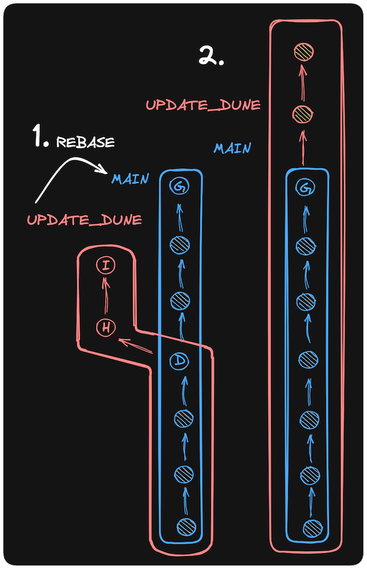

# Merge

* Farklı branch'lerde yapılan değişiklikleri birleştirmek için kullanılır.

```bash
A - B - C    main
   \
    D - E    other_branch
```

```bash
A - B - C - F    main
   \     /
    D - E        other_branch
```

## Örnek Bir Senaryo

* `main` branch'ine geçelim ve `contents.md` dosyasını oluşturalım.

```bash
git switch main
```

```bash
nano contents.md
```

```bash
# contents

- titles.md: The movie titles in the WebFlyx collection
- quotes: A directory of files containing memorable quotes from movies
```

```bash
git add contents.md
git commit -m "D: Add contents.md"
```

*  `add_classics` branch'inde `contents.md` dosyasını güncelleyelim.

```bash
nano contents.md
```

```bash
# contents

- titles.md: The movie titles in the WebFlyx collection
- classics.csv: A comma-separated list of classic movies
- quotes: A directory of files containing memorable quotes from movies
```

```bash
git add contents.md
git commit -m "E: Add contents.md"
```

* `main` branch'ine geçelim ve `add_classics` branch'ini `main` branch'ine birleştirelim.

```bash
git switch main
```

```bash
git merge add_classics
```

```bash
git log --oneline --decorate --graph --parents
```

# Rebase

* Farklı branch'lerde yapılan değişiklikleri birleştirmek için kullanılır. Fakat `merge`'den farklı olarak, `rebase` işlemi sonucunda commit geçmişi değişir.

```bash
A - B - C    main
   \
    D - E    feature_branch
```

```bash
A - B - C         main
         \
          D - E   feature_branch
```

* feature_branch'ini `main` branch'ine `rebase` işlemi uygulayarak birleştirelim.

```bash 
git switch feature_branch
```

```bash
git rebase main
```

```bash
A - B - C - D - E    main
```




# Reset

* `reset` komutu, commit geçmişindeki bir değişikliği geri almak için kullanılır.

```bash
A - B - C - D    main
```

```bash
A - B - C    main
```

## Hard Reset

* `hard reset`, commit geçmişindeki bir değişikliği geri alır ve çalışma dizinindeki dosyaları da değiştirir.

```bash
git reset --hard COMMIT_HASH
```

## Soft Reset

* `soft reset`, commit geçmişindeki bir değişikliği geri alır fakat çalışma dizinindeki dosyaları değiştirmez.

```bash
git reset --soft COMMIT_HASH
```
# Remote    

* `remote` komutu, uzak depoları yönetmek için kullanılır. Git, bir projeyi birden fazla kişiyle paylaşmak için kullanılır. Bu nedenle, projenin uzak bir depoda barındırılması gerekebilir. Örnek olarak yeni bir repo oluşturup, bu repoyu uzak bir depo olarak ekleyelim.

```bash
mkdir git-rehberi-remote
cd git-rehberi-remote
git init
```

```bash
git remote add origin {REMOTE_REPO_URL}
```

```

# Fetch

* `fetch` komutu, uzak depodaki değişiklikleri yerel depoya indirmek için kullanılır. Yalnızca değişiklikleri indirir, yerel dosyaları değiştirmez. 

```bash
git fetch origin/main
```

```bash
git log --oneline
```

```bash
git log --oneline origin/main
```

# Remote Merge

* `merge` komutu, uzak depodaki değişiklikleri yerel depoya birleştirmek için de kullanılır.

```bash
git merge origin/main
```

* Fetch ve merge işlemlerini aynı anda yapmak için `pull` komutunu kullanabiliriz.

# Pull

* `pull` komutu, uzak depodaki değişiklikleri yerel depoya indirir ve birleştirir.

```bash
git pull origin main
```

veya

```bash
git pull <remote-branch>
```
# Push

* `push` komutu, yerel depodaki değişiklikleri uzak depoya göndermek için kullanılır.

```bash
git push origin main
```
veya

```bash
git push <local-branch>:<remote-branch>
```


# GitHub Repositories

* GitHub, Git depoları (projeleri) için çevrimiçi en popüler web sitesidir. Yani, merkezi bir web sitesinde "remotes" barındırmak içindir. GitHub birkaç amaca hizmet eder:
    
        - Git depolarınızı depolamak
        - Git depolarınızı başkalarıyla paylaşmak
        - Başkalarının depolarını kopyalamak ve üzerinde çalışmak
        - Başkalarının depolarına katkıda bulunmak
        
# Git != GitHub

* Git ve GitHub, birbirinden farklı şeylerdir. Git, bir versiyon kontrol sistemidir. GitHub ise Git depolarınızı depolamak ve paylaşmak için bir web sitesidir.

# Pull Request ve Merge

* Pull request, bir projeye katkıda bulunmak için kullanılır. Bir pull request oluşturduğunuzda, projenin sahibi değişikliklerinizi inceleyebilir ve projeye eklemek için onaylayabilir.

# Gitignore

* `.gitignore` dosyası, Git'in belirli dosyaları ve klasörleri yoksaymasını sağlar. Bu dosyalar ve klasörler, Git tarafından izlenmez ve depolanmaz.

```bash
nano .gitignore
```

```bash
# Ignore .DS_Store files
.DS_Store
images/
*.log
deneme*
```
