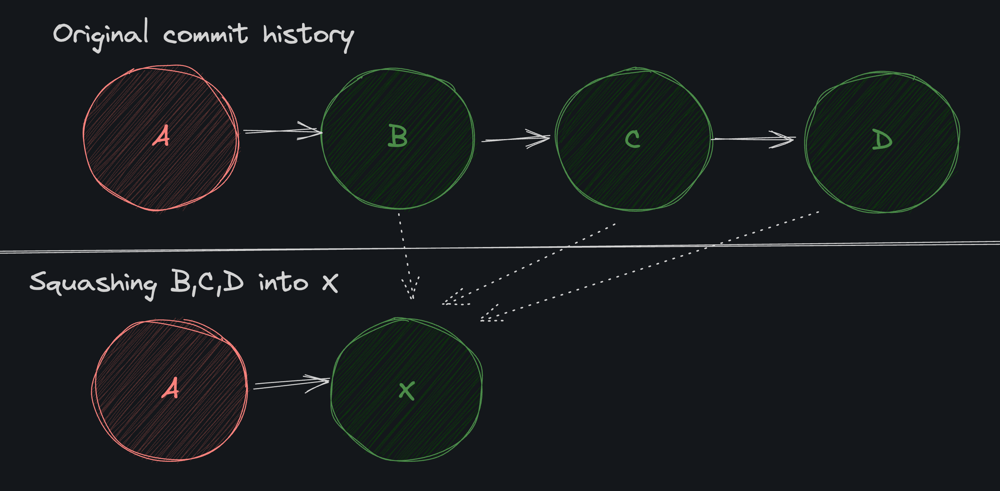

# Fork

* `fork` komutu, bir projeyi kendi hesabınıza kopyalamanızı sağlar. Bu işlem, projenin orijinaline dokunmadan kendi projenizde değişiklik yapmanızı sağlar.

* `fork` işlemi, projenin sağ üst köşesindeki "Fork" butonuna tıklayarak yapılabilir.

* Forking bir Git işlemi değildir, ancak GitHub, GitLab ve Bitbucket gibi birçok Git barındırma hizmetinin sunduğu bir özelliktir.

# Clone

* `clone` komutu, bir projeyi GitHub, GitLab veya Bitbucket gibi bir Git barındırma hizmetinden yerel bilgisayarınıza kopyalamanızı sağlar.

```bash
git clone <repository-url>
```

* `clone` komutu, projeyi kopyaladıktan sonra otomatik olarak `origin` adında bir remote ekler.

# PRs From a Fork

* `pull request` (PR) komutu, bir projenin orijinaline değişikliklerinizi göndermek için kullanılır.

* Adımlar şu şekildedir:

    1. Orijinal projeyi forklayın.
    2. Yerel bilgisayarınıza fork'ladığınız projeyi kopyalayın.
    3. Yerel projenizde yeni bir branch oluşturun ve değişiklikler yapın.
    4. Değişikliklerinizi commit edin.
    5. Değişikliklerinizi GitHub'a göndermek için `push` komutunu kullanın.
    6. GitHub'da, orijinal projenin sayfasına gidin.
    7. "Pull Request" butonuna tıklayın.
    8. Değişikliklerinizi açıklayan bir başlık ve açıklama ekleyin.
    9. "Create Pull Request" butonuna tıklayın.

# Reflog

* `reflog` komutu, HEAD referansındaki tüm değişiklikleri gösterir.

```bash
git reflog
```

# Örnek Bir Senaryo

* Üzerinde çalıştığımız repository'de yeni bir dosya oluşturup, bu dosyada değişiklikler yapalım.

```bash
git switch main
```

* Yeni bir dosya oluşturalım ve değişiklikleri commit edelim.

```bash
nano test-file.md
````

```bash
git add test-file.md
git commit -m "H: Add test-file.txt"
```

```bash
git reflog
```

* `git reset --hard HEAD@{1}` komutu ile son commit'e geri dönelim.

```bash
git reset --hard HEAD@{1}
```

* `git reflog` komutu ile geri dönüş işleminin kaydını görelim.

```bash
git reflog
```

# Merge

* `git merge <commithash>` komutu, belirtilen commit'i mevcut branch'e ekler.

* `git reset` komutu ile kaybolan commit'leri geri getirebiliriz.

```bash
git reflog
```

* `git merge` komutu ile commit'i geri getirelim.

```bash
git merge <commithash>
```
# Conflicting Changes

* `conflicting changes` (çakışan değişiklikler), iki farklı branch'te aynı satırlarda yapılan değişikliklerdir.

* `conflicting changes` durumunda, Git otomatik olarak birleştirme işlemi gerçekleştiremez ve çakışan değişiklikleri çözmeniz gerekir. Örneğin:

    * İki farklı branch'te aynı satırda farklı değişiklikler yapılmışsa.
    * Bir branch'te bir satır silinmişken, diğer branch'te aynı satıra yeni bir satır eklenmişse.


```bash
git switch -c add_customers
```

```bash
nano titles.md
```

```bash
- Forrest Gump
```

```bash
git add titles.md
git commit -m "J: Add Forrest Gump in titles.md"
```

```bash
git switch main
```

```bash
nano titles.md
```

```bash
- The Shawshank Redemption
```

```bash
git add titles.md
git commit -m "I: Add The Shawshank Redemption in titles.md"
```

* `git merge` komutu ile iki branch'i birleştirelim.

```bash
git switch add_customers
```

```bash
git merge main
```

* Şöyle bir hata alacağız:

```bash
Automatic merge failed; fix conflicts and then commit the result.
```

* Çakışmaları çözmek manuel bir işlemdir. Çakışmalar gerçekleştiğinde, Git çakışan dosyaları işaretler ve dosyaları düzenleyicinizde düzenleyerek çakışmayı çözmenizi ister.

```bash
<<<<<<< HEAD
- Forrest Gump
=======
- The Shawshank Redemption
>>>>>>> main

```
* En üstteki bölüm, <<<<<< HEAD ve ======= satırları arasında kalan kısım, dosyamızın dalımızdaki sürümüdür. ======= ve >>>>>>> main satırları arasında kalan kısım ise, birleştirmeye çalıştığımız branch'teki sürümüdür.

* Bu durumda çakışma mesajlarını silip, hem add_customers hem de main branch'lerindeki değişiklikleri içerecek şekilde dosyayı düzenleyelim.

```bash
- Forrest Gump
- The Shawshank Redemption
```

* Düzenleme işleminden sonra dosyayı kaydedip, commit edelim.

```bash
git add titles.md
git commit -m "K: Merge main into add_customers"
```

* Değişiklikleri `main` branch'ine gönderelim.

```bash
git switch main
git merge add_customers
```
* add_customers branch'ini silelim.

```bash
git branch -d add_customers
```

# Checkout conflicts

* Çakışmaları çözmek için dosyaları manuel olarak düzenledik, ancak Git'in bize yardımcı olacak bazı yerleşik araçları bulunur.

* `git checkout` komutu, --theirs veya --ours bayraklarını kullanarak birleştirme çakışması sırasında yapılan değişiklikleri tek tek kontrol edebilir.

* Yeni bir branch oluşturalım ve bu branch'te bazı değişiklikler yapalım.

```bash
git switch -c delete_records
```

```
nano classic.csv
``

* En alttaki satırı silelim.

```bash
nano contents.md
```

* En alttaki satırı silelim.

* Ardından commit edelim.

```bash
git add classic.csv contents.md
git commit -m "L: Delete the last record in classic.csv and change the last line in contents.md"
```

* `main` branch'ine geri dönelim ve aynı satırlarda değişiklikler yapalım.

```bash
git switch main
```

```bash
nano classic.csv
```

* En alttaki satırı değiştirelim.

```bash
nano contents.md
```

* En alttaki satırı değiştirelim.

* Ardından commit edelim.

```bash
git add classic.csv contents.md
git commit -m "M: Change the last record in classic.csv and change the last line in contents.md"
```

* `delete_records` branch'ini `main` branch'ine birleştirelim.

```bash
git merge delete_records
```

* Çakışma mesajı alacağız.

* `git checkout` komutu ile çakışmaları çözelim.

```bash
git checkout --theirs classic.csv
````
```bash
git checkout --ours contents.md
```

* Değişiklikleri commit edelim.

```bash
git add classic.csv contents.md
git commit -m "N: Merge delete_records into main"
```

# Rebase Conflicts

* `rebase`komutu ile oluşabilecek çakışmaları inceleyelim.

* Yeni bir branch oluşturalım ve bu branch'e yeni bir dosya ekleyelim.

```bash
git switch -c banned
```

```bash
nano banned.csv
```

```bash
first_name,last_name,company,title
Kayha,tbd,TheMarchOfTime,sidekick
sam,ctrlman,closedai,ceo
```

* Ardından commit edelim.

```bash
git add banned.csv
git commit -m "O: Add banned.csv"
```
* main branch'ine geri dönelim ve aynı dosyayı oluşturup, farklı bir değişiklik yapalım.

```bash
git switch main
```

```bash
nano banned.csv
```

```bash
first_name,last_name,company,title
Ballan,Agrandian,Boots.lore,Protagonist
sam,ctrlman,closedai,ceo
```

* Ardından commit edelim.

```bash
git add banned.csv
git commit -m "P: Add banned.csv"
```

* `banned` branch'ini `main` branch'ine rebase edelim.

```bash
git switch banned
```

```bash
git rebase main
```

* Çakışma mesajı alacağız.Ayrıca hangi branch Üzerinde olduğumuzu inceleyelim.

```bash
git branch
```

* Diğer branch üzerinden gelen değişiklikleri kabul etmek istiyoruz. Çakışmayı nasıl çözeriz?

```bash
git checkout --ours banned.csv
```

* Değişiklikleri ekleyelim fakat commit etmeyelim.

```bash
git add banned.csv
```

```bash
git log --oneline
```

* Rebase işlemini devam ettirelim.

```bash
git rebase --continue
```

* Rebase işlemi tamamlandıktan sonra, git log --oneline komutu ile commit geçmişini inceleyelim.

```bash
git log --oneline
```

* `main` branch'ine geri dönelim ve `banned` branch'ini silelim.

```bash
git switch main
git branch -d banned
```

# Squash

* `squash` komutu, birden fazla commit'i tek bir commit haline getirir.



* Yeni bir branch oluşturalım ve bu branch'e geçelim.

```bash
git switch -c temp_main
```


